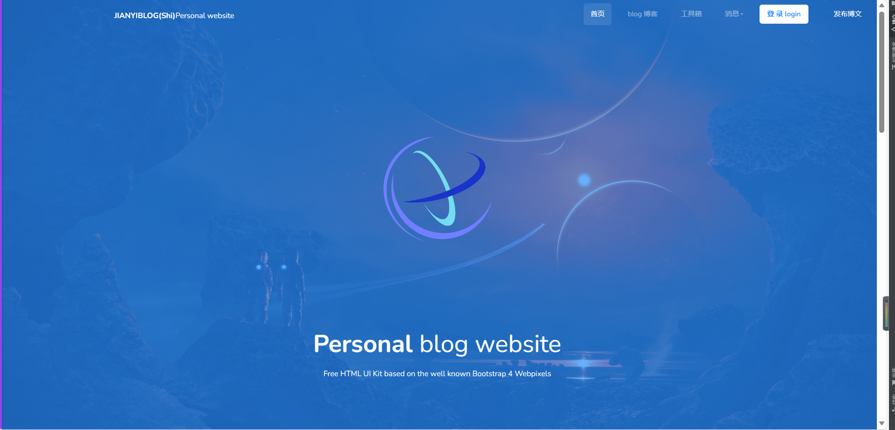
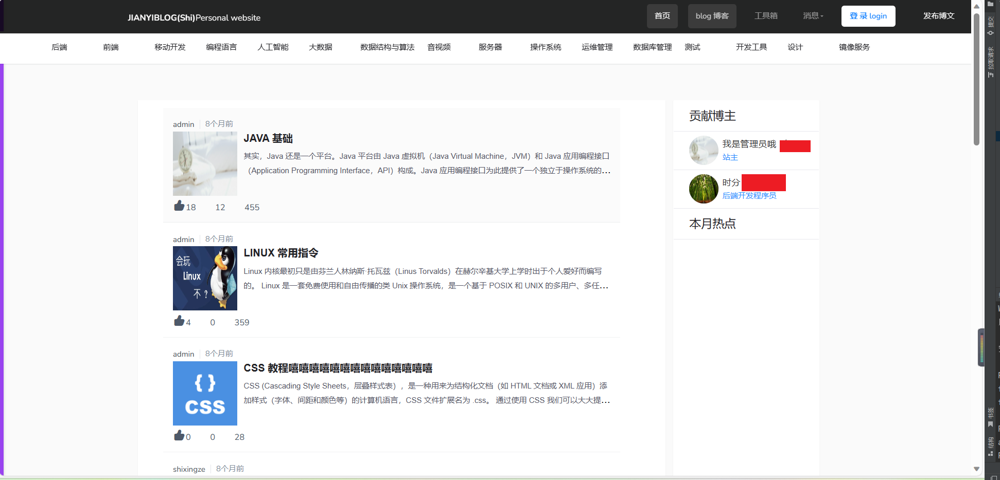
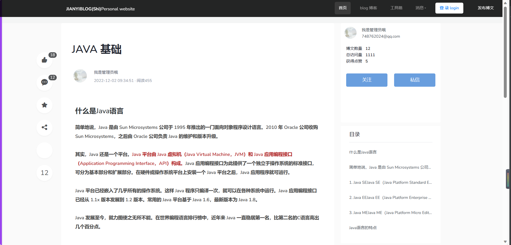

_# jianyi-blog

#### Description
jainyi 博客系统

#### Software Architecture
 后端   java语言编写  springboot - mybatis -mysql -shiro

#### 结构

 ###### jianyi-api 核心模块 包含权限、博客相关功能
 ###### jianyi-api-db数据库sql文件
###### jianyi-email 邮箱验证码发送模块
###### jianyi-eureka 注册中心模块
###### jianyi-rabbitmq 消息队列模块
#### 运行

1.  运行 JianyiBlogApplication.java 进行后台的运行  注意配置数据库文件
2.  前端 配置端口ip 则可直接运行 npm run dev

#### 相关图片
1、首页

2、文章列表

3、文章详情页

一起创造
qq 1731150369
wx ze_213